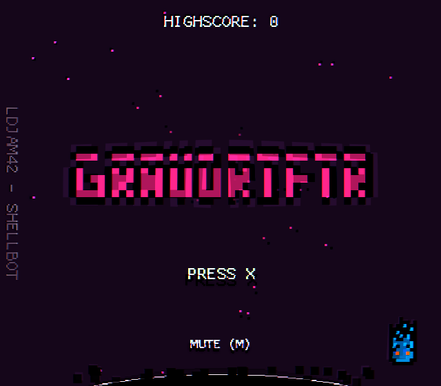
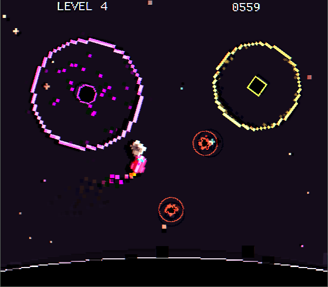

# GravDriftr

## [Play Gravdriftr Now!](http://twitter.com/_shellbot_)

### About
GravDriftr was made in 48 hours for LudumDare 42, the theme was "Running out of Space". GravDriftr is an endless runner where you need to duck and weave to dodge incoming comets, gravity wells, and outrun the oncoming black hole.

### Made using
 - Godot3
 - GraphicsGale
 - milkytracker
 - sfxr
 - google
